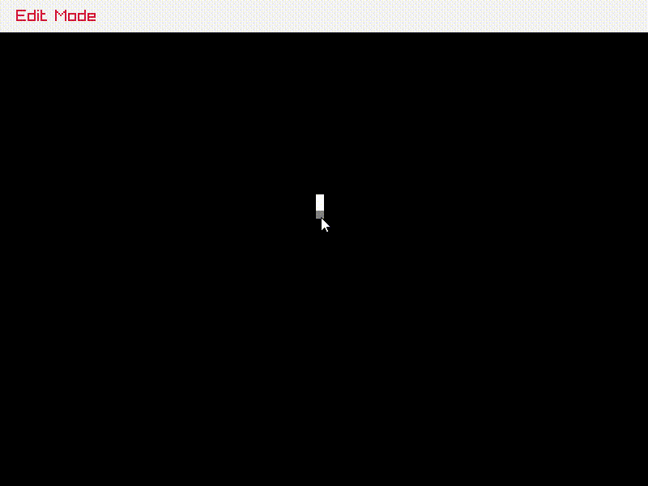

# Cogol.c (Conway's Game of Life / C + Raylib)
**Warning** : This is totally unoptimized, but it is functional



## Controls
|Button|Action|
| :-----: | -------------------- |
| **E**   | Edit Mode            |
| **R**   | Run Automata         |
| **C**   | Clear (in Edit Mode) |
| **LMB** | enable cell          |
| **RMB** | disable cell         |

### Building and Running
#### Windows
**requires mingw64 gcc and make**

```
make && cogol.exe
```

#### Linux / Mac OS
**replace raylib build with platform specific one**
```
make && ./cogol
```